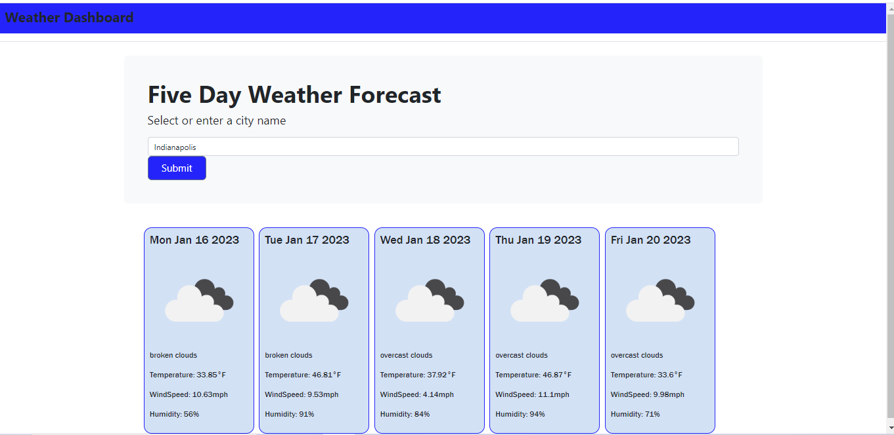

# WhatsTheWeather
https://github.com/ampatte/WhatsTheWeather

  

  ## Description
  A 5 Day Forecast Weather Dashboard
    
  ## Table of Contents
  - [Installation Instructions](#Installation)
  - [Usage Information](#Usage)
  - [Contribution Guidelines](#Contribution)
  - [Test Instructions](#Test)
  - [Questions](#Questions)
  - [License](#License)
  
  ## Installation
  There are no requirements. The url can be run in any web browser.

  ## Usage
  This project was created for an assignment. It will be used to check weather forecasts. It is a quick and easy way to check the weather before planning for future events.

Acceptance Criteria
  - GIVEN a weather dashboard with form inputs
  - WHEN I search for a city
  - THEN I am presented with current and future conditions for that city and that city is added to the search history
  - WHEN I view current weather conditions for that city
  - THEN I am presented with the city name, the date, an icon representation of weather conditions, the temperature, the humidity, and the the wind speed
  - WHEN I view future weather conditions for that city
  - THEN I am presented with a 5-day forecast that displays the date, an icon representation of weather conditions, the temperature, the wind speed, and the humidity
  - WHEN I click on a city in the search history
  - THEN I am again presented with current and future conditions for that city

  
  
  ## Contribution
  I am the only contributer. Others can contact me by email.

  ## Test
  Enter a city into the search bar and press submit to display the forecast.

  ## Questions?
  - Github link: https://github.com/ampatte
  - Email link: ampatte717@gmail.com

  ## License
    This project is covered under the MIT license.(https://choosealicense.com/licenses/mit/)
